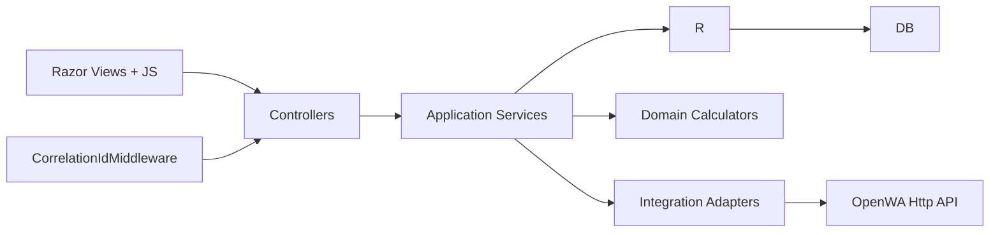
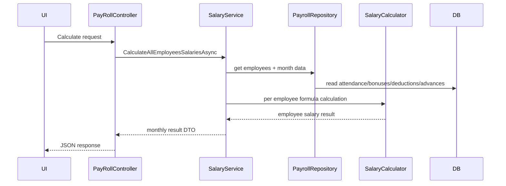
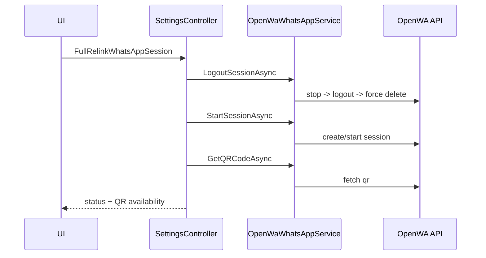
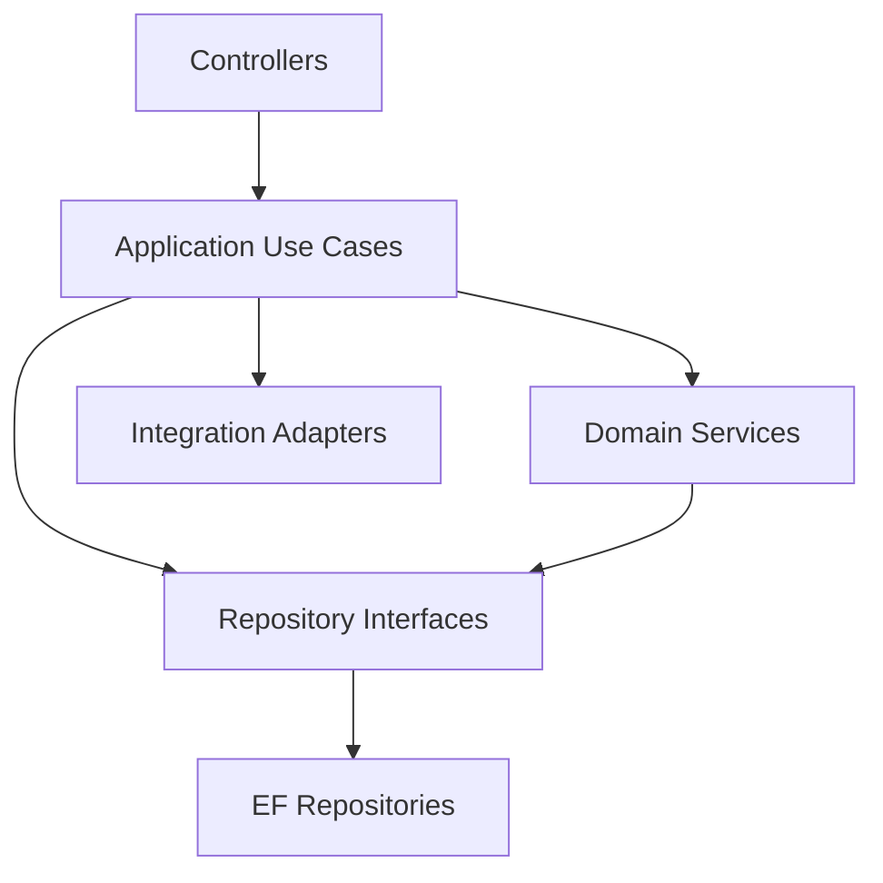

# HR System Architecture Reference

## 1) Purpose of This Document

This file is the main technical reference for any developer or AI assistant working on this project.

Use it to:
- Understand the system quickly.
- Know where code should be added.
- Avoid breaking existing payroll and attendance logic.
- Identify current architecture weaknesses and how to fix them.

---

## 2) System Summary

HR System is an ASP.NET Core MVC monolith for:
- Employee and organization data management.
- Attendance and monthly attendance handling.
- Payroll calculation, saving, and reporting.
- WhatsApp integration (OpenWA) for sending payroll text + PDF.
- Backup and deployment utilities.

Core stack:
- .NET 9 MVC
- Entity Framework Core + SQL Server
- ASP.NET Identity
- QuestPDF
- OpenWA (external Docker service)

---

## 3) High-Level Architecture (Current State)

Important note:
- Current default flow is Controller -> Service -> Repository.
- Phases 1, 2, and 3 were implemented and enforced with architecture tests.

---

## 4) Project Structure and Responsibilities

### 4.1 Presentation Layer

- `Controllers/`
	- Entry points for HTTP endpoints and pages.
	- Should validate request shape, call services, and return response.
	- Should not contain heavy business logic.

- `Views/`
	- Razor UI.
	- Includes payroll screen, settings, WhatsApp settings.

### 4.2 Application Layer

- `Services/Interfaces/`
	- Contracts used by controllers.

- `Services/`
	- Use cases and orchestration.
	- Examples: employee management, attendance processing, payroll service, backup, WhatsApp.

- `DTOs/`
	- Request and response contracts between UI/controller/service.

### 4.3 Domain Layer

- `Domain/SalaryCalculation/`
	- Pure payroll formulas and aggregation logic.
	- Critical business rules live here.

### 4.4 Data Access Layer

- `Data/ApplicationDbContext.cs`
	- EF Core model and mappings.

- `Repositories/`
	- Query and persistence logic.
	- Payroll repository and attendance repository currently hold significant query logic.

- `Models/`
	- Entity models mapped to database tables.

### 4.5 Infrastructure and Integration

- `Services/WhatsApp/`
	- OpenWA integration adapter (`HttpClient` + session lifecycle + send text/file + standardized operation result).

- `Middleware/ConditionalAuthMiddleware.cs`
	- Allows initial unauthenticated access when no users exist.

- `Middleware/CorrelationIdMiddleware.cs`
	- Adds/propagates `X-Correlation-ID` header for request/response and logging scopes.

- `Deployment/` and `evolution-api/`
	- Packaging scripts and OpenWA runtime config.

---

## 5) Runtime Bootstrapping

Startup behavior in `Program.cs`:
- Configures DbContext and Identity.
- Registers services, repository interfaces, alias interfaces, and WhatsApp client.
- Registers `IHttpContextAccessor` for correlation-aware logging.
- Applies migrations on startup.
- Ensures admin role exists and first-user safety logic.
- Configures static assets, correlation middleware, auth, routing, and conditional auth middleware.

Operational implication:
- App expects DB availability at startup.
- App can mutate schema automatically (migration on run).

---

## 6) Core Business Flows

### 6.1 Payroll Calculation Flow

### 6.2 Payroll Save/Recalculate Flow

- Save:
	1) Recompute salaries from request parameters.
	2) Upsert payroll records in DB.
- Recalculate single employee:
	- Re-runs formula and updates one payroll record.

### 6.3 WhatsApp Session + Send Flow

---

## 7) Current Architecture Gaps (Must Know)

Implemented fixes:

1. Manual dependency construction removed from application services.
- Salary and monthly attendance services use interface-driven DI.

2. Controller business logic extraction completed for WhatsApp payroll and settings workflows.
- Use cases moved to dedicated services.

3. Repository orchestration boundary cleaned.
- Monthly attendance auto-population is now handled through `IMonthlyAttendanceRepository` from service layer.

4. Integration result model standardized.
- WhatsApp send operations return `WhatsAppOperationResult`.

5. Typo naming migration started safely.
- Alias interfaces added (`IAttendance*`, `IBonus*`) while keeping legacy names for compatibility.

Remaining gaps:

1. Legacy entity and table names still use typo forms (`Attendence`, `Bounes`).
- This requires migration strategy and compatibility mapping before full rename.

2. Some non-WhatsApp controllers are still larger than ideal.
- Further extraction to dedicated use-case services is recommended.

---

## 8) Target Architecture (Recommended)

Adopt this shape incrementally:

### Design Rules

1. Controllers:
- Input validation + response only.

2. Application services/use cases:
- Own workflow orchestration.
- Call repositories and integrations.

3. Domain:
- Pure calculation/business rules.
- No framework or DB concerns.

4. Repositories:
- Only persistence/query operations.

5. Integration adapters:
- Isolate external APIs (OpenWA, future channels).

---

## 9) Fix Plan for Architecture Drift

### Phase 1 (Safe, high value)

1. Convert concrete dependency creation to DI.
- Inject payroll repository and salary calculator abstractions into salary service.

2. Extract WhatsApp payroll send use case.
- Move send-text/send-pdf workflow from payroll controller into a dedicated service.

3. Extract settings WhatsApp PDF builder/use case.
- Keep settings controller thin.

Status: Implemented.

### Phase 2 (Boundary cleanup)

1. Split repositories by aggregate.
- Payroll read/write separated from monthly attendance population orchestration.

2. Introduce integration-level result model.
- Standardized success/partial/failure result for WhatsApp operations.

3. Add explicit mapping layer.
- Use mapper methods per module instead of ad-hoc projection everywhere.

Status: Implemented for repository boundaries and integration result model. Mapping centralization is partially complete and can be expanded.

### Phase 3 (Consistency and quality)

1. Rename typo models safely (with migration aliases).
2. Add architecture tests (layer dependency checks).
3. Add structured logging correlation IDs around payroll and WhatsApp operations.

Status: Implemented.

Implemented Phase 3 outputs:

1. Compatibility aliases for naming cleanup.
- Added `IAttendanceRepository`, `IAttendanceService`, `IBonusService` with backward-compatible wiring.

2. Architecture guard tests.
- Added a dedicated architecture test project under `tests/HR-system.ArchitectureTests`.
- Enforces DI repository usage and middleware registration.

3. Correlation ID logging.
- Added `CorrelationIdMiddleware`.
- Added correlation-aware logging scopes in payroll WhatsApp and OpenWA services.

---

## 10) Development Guidelines

When adding a new feature:

1. Add/extend DTOs first.
2. Add service interface method in `Services/Interfaces`.
3. Implement logic in service (not controller).
4. Keep repository focused on data access.
5. Keep controller endpoint small and declarative.
6. Add migration only for actual model changes.
7. Build and run smoke test for the touched flow.

---

## 11) Troubleshooting Quick Map

1. Payroll result mismatch:
- Check monthly attendance source of truth.
- Check salary calculation type from shift.
- Check carry-over from previous month.

2. WhatsApp QR/session issues:
- Verify OpenWA service availability.
- Validate session lifecycle (stop/logout/delete/start).
- Confirm API key and base URL configuration.

3. Save/update issues:
- Verify migration status and model snapshot consistency.

---

## 12) AI Assistant Working Protocol

Any AI assistant modifying this codebase should follow:

1. Do not place business logic in controllers.
2. Prefer interface-driven DI over direct `new` creation.
3. Preserve payroll formula behavior unless explicitly requested.
4. Keep OpenWA lifecycle semantics intact when editing WhatsApp code.
5. Run build after structural changes.

---

## 13) Current Architectural Verdict

The project is now in a strong transitional architecture state.

Main reason:
- Core high-risk coupling points identified in earlier phases were addressed.
- Remaining work is mostly consistency and naming evolution, not structural instability.

Good news:
- The codebase now has both implementation-level fixes and automated architecture guards, so future contributions can maintain direction reliably.

---

## 14) Validation Snapshot (Latest)

- Application build: passing.
- Architecture tests: passing.
- WhatsApp integration path: using standardized operation result and correlation-aware logging.

