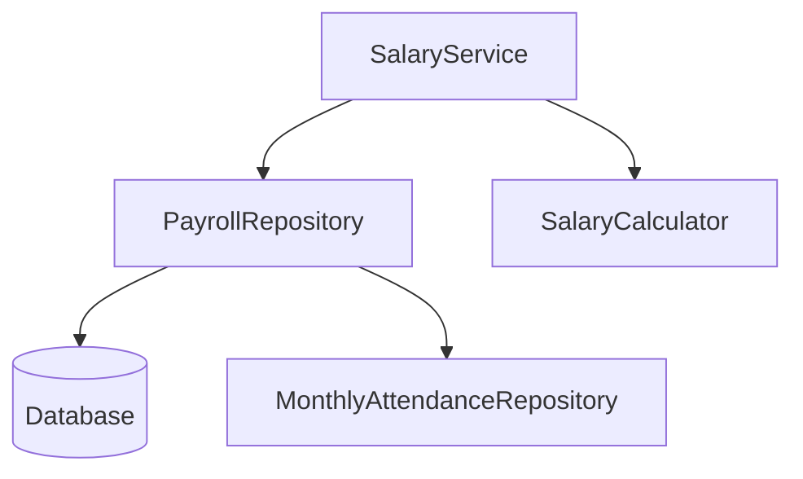
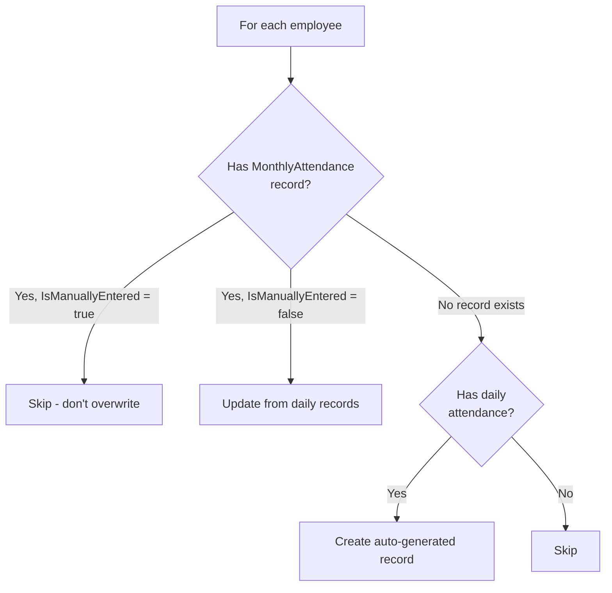
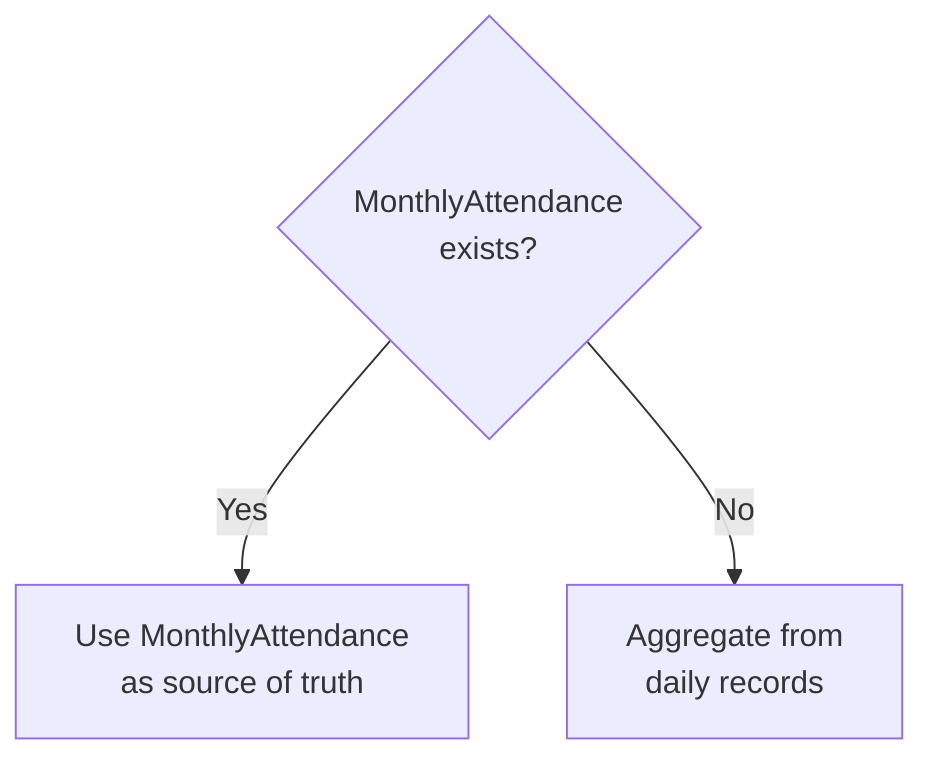
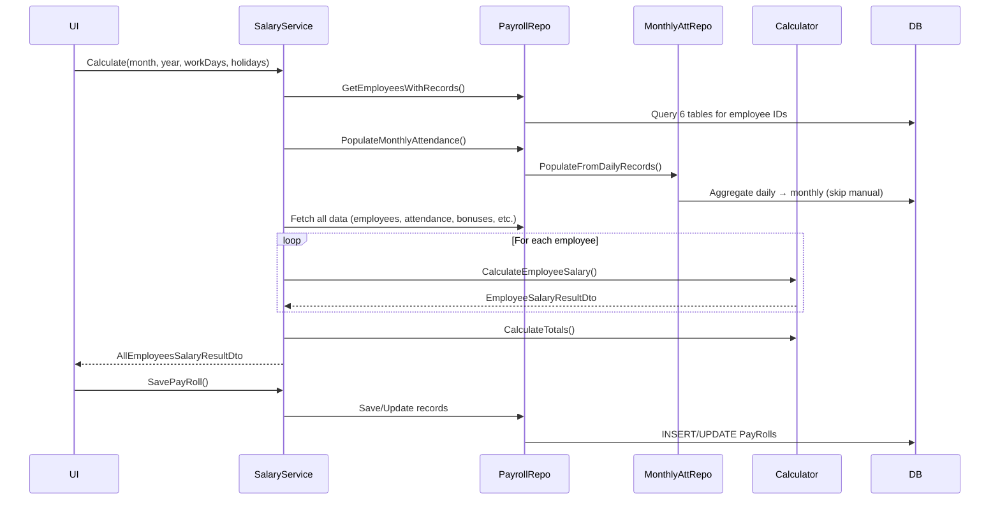

# بنية حساب المرتبات - Salary Calculation Architecture

## نظرة عامة | Overview

نظام حساب المرتبات مبني على بنية ثلاثية الطبقات:



| Layer | File | Role |
|-------|------|------|
| **Service** | `SalaryService.cs` | Orchestration & coordination |
| **Domain** | `SalaryCalculator.cs` | Core business logic & formulas |
| **Repository** | `PayrollRepository.cs` | Data access & persistence |
| **Repository** | `MonthlyAttendanceRepository.cs` | Monthly attendance aggregation |

---

## خطوات حساب المرتبات | Salary Calculation Steps

### Step 1: Trigger Calculation
The process starts when the user requests salary calculation via `SalaryService.CalculateAllEmployeesSalariesAsync()` with:
- **Month** & **Year**
- **Working Days in Month** (user input)
- **Holidays in Month** (user input)

### Step 2: Identify Employees
`PayrollRepository.GetEmployeesWithRecordsInMonthAsync()` collects all employee IDs from **6 data sources**:

| Source | Table |
|--------|-------|
| Daily Attendance | `Attendences` |
| Monthly Attendance | `MonthlyAttendances` |
| Bonuses | `Bounes` |
| Deductions | `Deductions` |
| Advances | `Advances` |
| Attendance Adjustments | `AttendanceAdjustments` |

The union of all employee IDs ensures no employee is missed.

### Step 3: Auto-Populate Monthly Attendance
`MonthlyAttendanceRepository.PopulateFromDailyRecordsAsync()` runs **before** calculation:



> **Key Rule**: Manual entries (`IsManuallyEntered = true`) are **never overwritten** by auto-generation.

**Aggregated fields from daily records:**
- `PresentDays` = count of non-absent days
- `AbsentDays` = count of absent days
- `WorkedMinutes` = sum of all worked minutes
- `LateMinutes` = sum from `LateTime` records
- `OvertimeMinutes` = sum from `OverTime` records
- `EarlyDepartureMinutes` = sum from `EarlyDeparture` records
- `PermissionMinutes` = sum of `Permission_time`

### Step 4: Fetch All Data
`PayrollRepository` fetches all related data for the month:
- Employee records (with `Department` & `Shift` relations)
- Daily attendance records (with `LateTime`, `OverTime`, `EarlyDeparture`)
- Bonuses, Deductions, Advances, Attendance Adjustments
- Monthly Attendance records
- **Previous Month Payrolls** (to fetch the standalone `SalaryCarryOver` for each employee)

### Step 5: Per-Employee Calculation
`SalaryCalculator.CalculateEmployeeSalary()` runs for **each employee**:

---

## تفاصيل الحساب | Calculation Details

### 5.1 Configuration from Shift
Each employee's calculation is configured by their assigned **Shift**:

| Parameter | Source | Default |
|-----------|--------|---------|
| `ShiftHoursPerDay` | `Shift.StandardHours` | 8 |
| `SalaryCalculationType` | `Shift.SalaryCalculationType` | Hourly |
| `EarlyDepartureMultiplier` | `Shift.EarlyDepartureMultiplier` | 1.0 |
| `OvertimeMultiplier` | `Employee.Rate_overtime_multiplier` | — |
| `LateTimeMultiplier` | `Employee.Rate_latetime_multiplier` | — |

### 5.2 Rate Calculations

```
SalaryPerHour = MonthlySalary / (WorkingDays × HoursPerDay)
SalaryPerDay  = MonthlySalary / WorkingDays
```

### 5.3 Attendance Data Source



**If MonthlyAttendance exists:** Use its values directly (presentDays, absentDays, workedMinutes, etc.)

**If no MonthlyAttendance:** Calculate from daily `Attendence` records:
- PresentDays = count where `!Is_Absent`
- AbsentDays = count where `Is_Absent`
- Sum all worked minutes, overtime, late, early departure, permissions

### 5.4 Overtime & Latetime Calculation (Multiplier Logic)

This system has **two modes** based on multiplier values:

#### Mode 1: Either multiplier = 1 (Net Difference)
```
netHours = OvertimeHours - LateTimeHours

if netHours ≥ 0:
    amount = netHours × SalaryPerHour × OvertimeMultiplier    (positive = bonus)
if netHours < 0:
    amount = netHours × SalaryPerHour × LateTimeMultiplier    (negative = deduction)
```

#### Mode 2: Both multipliers ≠ 1 (Separate Calculation)
```
OvertimeAmount = OvertimeHours × SalaryPerHour × OvertimeMultiplier
LateDeduction  = LateTimeHours × SalaryPerHour × LateTimeMultiplier
NetAmount      = OvertimeAmount - LateDeduction
```

### 5.5 Early Departure Deduction
```
EarlyDepartureDeduction = (EarlyDepartureMinutes / 60) × SalaryPerHour × EarlyDepartureMultiplier
```

### 5.6 Financial Items

| Item | Formula | Effect |
|------|---------|--------|
| **Bonuses** (مكافآت) | Sum of `Amount` | + Added |
| **Deductions** (خصومات) | Sum of `Amount` | - Subtracted |
| **Advances** (سلف) | Sum of `Amount` | - Subtracted |
| **Attendance Adjustments** (تعديلات) | Value × SalaryPerDay (Days) or Value × SalaryPerHour (Hours) | +/- |

### 5.7 Base Salary Calculation

Two calculation types based on Shift configuration:

#### Hourly (بالساعة) — `SalaryCalculationType.Hourly`
```
BaseSalary = SalaryPerHour × (TotalWorkedMinutes / 60)
```

#### Daily (باليوم) — `SalaryCalculationType.Daily`
```
BaseSalary = SalaryPerDay × PresentDays
```

### 5.8 Final Salary Formula

```
NetSalary = BaseSalary
          + OvertimeAmount
          - LateTimeDeduction
          - EarlyDepartureDeduction
          - TotalDeductions
          - TotalAdvances
          + TotalBonuses
          + AttendanceAdjustmentAmount
          + PreviousMonthCarryOver

GrossSalary = BaseSalary + OvertimeAmount + TotalBonuses + PositiveAdjustments

TotalDeductions = LateTimeDeduction + EarlyDepartureDeduction
                + Deductions + Advances + NegativeAdjustments
```

---

## حفظ كشف المرتبات | Saving Payroll

### Step 6: Save to Database
`SalaryService.SavePayRollAsync()`:
1. Calculates all salaries (repeats steps 2-5)
2. For each employee:
   - If payroll record exists → **Update**
   - If no record → **Create new**
3. `PaidSalary` defaults to `NetSalary` rounded up to nearest 5

### Step 7: Recalculation
Two recalculation options:
- **All employees**: `CalculateAllEmployeesSalariesAsync()` → re-runs full process
- **Single employee**: `RecalculateSingleEmployeeAsync(payrollId)` → recalculates one employee and updates their payroll record

### Step 8: Manual Salary Carry-Over (ترحيل الراتب)
- During saving or updating from the UI, the HR user can manually enter a `SalaryCarryOver` value.
- This value is persisted directly in the `PayRoll` record for that month.
- It is automatically fetched during Step 4 the following month and applied to `NetSalary` as a completely independent value (preventing mixing with structured bonuses or deductions).

---

## خريطة الملفات | File Map

```
Domain/SalaryCalculation/
└── SalaryCalculator.cs          # Core formulas & business logic

Services/
├── SalaryService.cs             # Orchestration layer
└── Interfaces/
    └── ISalaryService.cs        # Service interface

Repositories/
├── PayrollRepository.cs         # Payroll data access & saving
└── MonthlyAttendanceRepository.cs  # Monthly attendance CRUD & auto-populate

Models/
├── PayRoll.cs                   # Payroll entity
├── MonthlyAttendance.cs         # Monthly attendance entity (IsManuallyEntered flag)
├── Employee.cs                  # Employee with Shift & Department
└── Enums/
    └── SalaryCalculationType.cs # Hourly=0, Daily=1

DTOs/
├── Salary/
│   ├── SalaryCalculationRequestDto.cs
│   ├── EmployeeSalaryResultDto.cs
│   └── AllEmployeesSalaryResultDto.cs
└── PayRoll/
    ├── SavePayRollRequestDto.cs
    └── SavePayRollResponseDto.cs
```

---

## ملخص التدفق الكامل | Full Flow Summary


